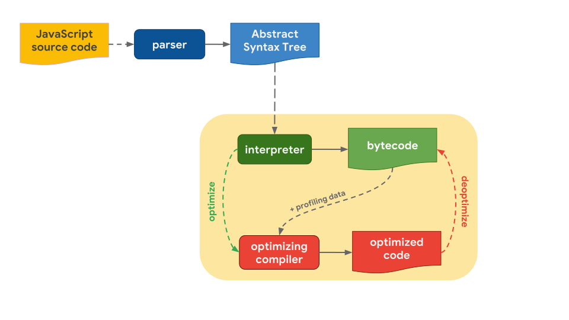

# V8 engine

google v8엔진은 `google chrom`과 `Node.js`에서 사용되고 있는 구글에서 제작한 자바스크립트 엔진이다.

`C++`로 작성되었고 자바스크립트 전용의 웹 어셈블리 엔진이다. 자바스크립트 엔진은 코드 한줄을 해석하고 바로 실행하는 인터프리터 형식이지만, V8엔진은 자바스크립트 코드를 바이트코드로 컴파일하고 실행하는 방식이다.

## V8 엔진 컴파일과정

자바스크립트 소스코드를 가져와서 파서에게 넘기면 소스코드를 분석한 후 AST(A bstract Syctax Tree, 추상구문트리)로 변환한다.

만들어진 AST는 컴파일러에서 바이트 코드로 컴파일한다. 컴파일된 바이트 코드를 실행함으로써 원하는 자바스크립트 동작이 실행된다.

* 바이트 코드를 실행하면서 프로파일링 을 통해 최적화 해야하는 데이터를 수집한다. 
* 프로파일링을 통해 찾은 데이터는 `TurboFan`을 통해 자수 사용되는 함수나 데이터를 기반으로 최적화를 진행하며, 최적화된 기계어 코드를 생성한다.
* 기계어 코드를 실행하여, 메모리 사용량을 줄이고, 속도와 성능을 향상시킨다.

### V8 Sanner와 Token

자바스크립트 파일은 Text로 이루어져 있으며, 이를 Network를 통해 다운받는다. 

V8엔진은 이 Text정보를 파싱하기저에 일정한 형태의 `UTF-16` 으로 변환하고, 스케너를 이용해 토큰을 생성한다.

이때 토큰은 미리 정의한 항복과 개발자가 정의한 함수나 변수들을 뜻한다.

* 자바스크립틔에 미리 정의되어있는 `for`, `const`, `if`, `function`같은 키워드
* 공백이나 탭
* 변수나 함수 식별자

Sanner 단계에서 속도를 올리기 위해서는 소스 코드를 축소하고, 불필요한 공백이나 주석을 제거하고, 비 ASCII식별자를 피하는것이 좋다.

## V8 Parser와 AST

V8에서든 모든 코드를 즉시 파싱하지 않는다.

* 실행하지 않을 코드를 컴파일하면 여러 리소스가 낭비된다.

* 컴파일 후 메모리에 적재하고 있어야 하기 때문에 가비지 컬렉터가 할당을 해지하기 전까지 메로리를 낭비하기 떄문이다.

이를 해결하기 위해 `Pre-parser`를 함께 진행한다.

토큰중 참조하지 않는 토큰을 pre-parser로 전달하여 실제 작업에 필요한 푀소한의 작업만을 파싱하고, pre-parser로 나중에 컴파일된다.

## V8 TurboFan

V8은 컴파일된 코드를 최적화하기 위해 터보팬으로 최적화된 바이트 코드를 만들어낸다.

터보팬은 자주 사용되는 코드를 재사용하여 코드 크기룰 줄이고, 메모리 오버헤드를 크게 줄여, 더 빠른 속도를 내고, 최적화된 그래프를 만들어낸다.

1. Graph Building : 바이트 코드 또는 AST 를 Graph 로 만든다.
2. Native Context Specialization & Inlining : Load / Store / Call IC 를 기반으로 기본 컨텍스트에 특화된 Simple Graph 를 생성한다.
3. Typed Optimization : Type 에 따라 Simple Graph 로 변환한다.
4. General Optimization : Graph 를 기반으로 중복 제거 같은 최적화를 진행한다.
5. Code Generation: 죽은 코드를 제거고, 레지스터에 할당한다.

v8에서 최적화를 진행하기 위해 Schedule과정을거치게 된다.

V8에서는 Turbofan을 이용해 메모리 사용량을 감소시키고, 실행시간을 단축하며, 코드의 크기를 줄여 빠른속도의 엔진이 되었다.

------
references

https://helloinyong.tistory.com/290#recentEntries

https://shlrur.github.io/javascripts/javascript-engine-fundamentals-shapes-and-Inline-caches/

[overall](https://pks2974.medium.com/v8-%EC%97%90%EC%84%9C-javascript-%EC%BD%94%EB%93%9C%EB%A5%BC-%EC%8B%A4%ED%96%89%ED%95%98%EB%8A%94-%EB%B0%A9%EB%B2%95-%EC%A0%95%EB%A6%AC%ED%95%B4%EB%B3%B4%EA%B8%B0-25837f61f551)