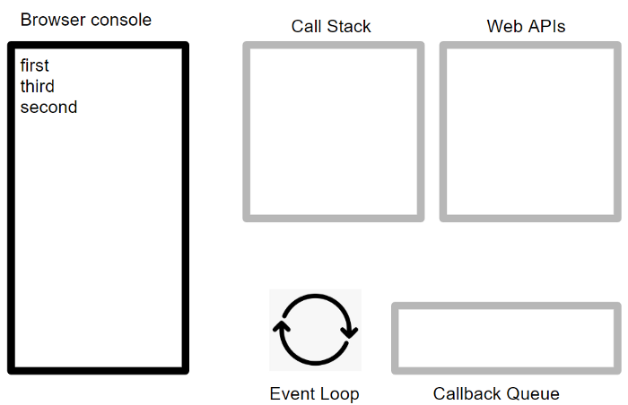

# V8 engine

google v8엔진은 `google chrom`과 `Node.js`에서 사용되고 있는 구글에서 제작한 자바스크립트 엔진이다.

`C++`로 작성되었고 자바스크립트 전용의 웹 어셈블리 엔진이다. 자바스크립트 엔진은 코드 한줄을 해석하고 바로 실행하는 인터프리터 형식이지만, V8엔진은 자바스크립트 코드를 바이트코드로 컴파일하고 실행하는 방식이다.


## V8 엔진 컴파일과정

자바스크립트 소스코드를 가져와서 파서에게 넘기면 소스코드를 분석한 후 AST(A bstract Syctax Tree, 추상구문트리)로 변환한다.

만들어진 AST는 컴파일러에서 바이트 코드로 컴파일한다. 컴파일된 바이트 코드를 실행함으로써 원하는 자바스크립트 동작이 실행된다.


* 바이트 코드를 실행하면서 프로파일링 을 통해 최적화 해야하는 데이터를 수집한다. 
* 프로파일링을 통해 찾은 데이터는 `TurboFan`을 통해 자수 사용되는 함수나 데이터를 기반으로 최적화를 진행하며, 최적화된 기계어 코드를 생성한다.
* 기계어 코드를 실행하여, 메모리 사용량을 줄이고, 속도와 성능을 향상시킨다.

### V8 Sanner와 Token

자바스크립트 파일은 Text로 이루어져 있으며, 이를 Network를 통해 다운받는다. 

V8엔진은 이 Text정보를 파싱하기저에 일정한 형태의 `UTF-16` 으로 변환하고, 스케너를 이용해 토큰을 생성한다.

이때 토큰은 미리 정의한 항복과 개발자가 정의한 함수나 변수들을 뜻한다.

* 자바스크립틔에 미리 정의되어있는 `for`, `const`, `if`, `function`같은 키워드
* 공백이나 탭
* 변수나 함수 식별자

Sanner 단계에서 속도를 올리기 위해서는 소스 코드를 축소하고, 불필요한 공백이나 주석을 제거하고, 비 ASCII식별자를 피하는것이 좋다.

## V8 Parser와 AST

V8에서든 모든 코드를 즉시 파싱하지 않는다.

* 실행하지 않을 코드를 컴파일하면 여러 리소스가 낭비된다.

* 컴파일 후 메모리에 적재하고 있어야 하기 때문에 가비지 컬렉터가 할당을 해지하기 전까지 메로리를 낭비하기 떄문이다.

이를 해결하기 위해 `Pre-parser`를 함께 진행한다.

토큰중 참조하지 않는 토큰을 pre-parser로 전달하여 실제 작업에 필요한 푀소한의 작업만을 파싱하고, pre-parser로 나중에 컴파일된다.

## V8 TurboFan

V8은 컴파일된 코드를 최적화하기 위해 터보팬으로 최적화된 바이트 코드를 만들어낸다.

터보팬은 자주 사용되는 코드를 재사용하여 코드 크기룰 줄이고, 메모리 오버헤드를 크게 줄여, 더 빠른 속도를 내고, 최적화된 그래프를 만들어낸다.

1. Graph Building : 바이트 코드 또는 AST 를 Graph 로 만든다.
2. Native Context Specialization & Inlining : Load / Store / Call IC 를 기반으로 기본 컨텍스트에 특화된 Simple Graph 를 생성한다.
3. Typed Optimization : Type 에 따라 Simple Graph 로 변환한다.
4. General Optimization : Graph 를 기반으로 중복 제거 같은 최적화를 진행한다.
5. Code Generation: 죽은 코드를 제거고, 레지스터에 할당한다.

v8에서 최적화를 진행하기 위해 Schedule과정을거치게 된다.


V8에서는 Turbofan을 이용해 메모리 사용량을 감소시키고, 실행시간을 단축하며, 코드의 크기를 줄여 빠른속도의 엔진이 되었다.

# 자바 스크립트 이벤트 루프

자바스크립트의 큰 특징중 하나는 '단일 스레드'기반의 언어라는 점이다. 이말은 동시에 하나의 작업만을 처리할 수 있다라는 말이다. 하지만 자바스크립트 환경에서는 많은 작업이 동시에 처리되고 있다. 어떻게 자바스크립트는 동시성을 지원하는걸까?

이떄 등장하는 개념이 이벤트 루프이다. 

자비스크립트의 '단일 스레드'기반의 언어라는 말은 `자바스크립트 엔진이 단일 호출 스택을 사용한다` 는 관점에서만 사실이다. 실제 자바스크립트가 구동되는 환경에서는 주로 여러개의 스레드가 사용되며 이런 환경이
단일 호출 스택을 사용하는 자바 스크립트 엔진과 상호 여농하기 위해 사용하는 장치가 `이벤트 루프`인 것이다.

브라우저 환경을 그림으로 나타내면 아래와 같다.


* 콜 스택 : 소스코드 평가 과정에서 생성된 실행 컨택스트가 추가되고 제거되는 스택 자료구조. 함수를 호출하면 실행 컨택스트가 순차적으로 실행된다. 자바스크립트 엔진은 단 하난의 콜 스택을 사용하기 때문에 최상위 실행 컨텍스트가 종료되어 콜 스택에서 제거되기 전까지는 다른 어떤 태스크도 실행되지 않는다.
* 힙 : 힙은 객체가 저장되는 메모리 공간이다. 콜 스택의 요소인 실행 컨텍스트는 힙에 저장된 객체를 잠조한다.

이처럼 콜 스택과 힙으로 구성되어있는 자바스크립트 엔진은 단순해 태스크가 요청되면 콜 스택을 통해 요청된 작업을 순차적으로 실행할 뿐이다. 

* 태스크 큐 : 비동기 함수의 콜백 함수 도는 이벤트 핸들러가 일시적이로 보관되는 영역
* 이벤트 루프 : 이벤트 루프는 콜 스택에 현재 실행중인 실행 컨택스트가 있는지, 그리고 태스크 큐에 대기중인함수가 있는지 반복적으로 학인한다. 콜 스택이 비어있고 태스크 큐에 대기중인 함수가 있다면, 이벤트 루프는 순차적으로 태스크 큐에 대기중인 함수를 콜 스택으로 이동시킨다.

### 브라우저 환경에서 이벤트 루프 예시

```js

console.log('first')

setTimeout(function cb() {
    console.log('second')
}, 1000); // 0ms 뒤 실행

console.log('third')
//먼저 실행될 함수는 ?
```

1. console.log('first')가 `Call Stack`에 추가된다.

2. console.log('first')가 실행되어 화면에 출력한뒤 `Call Stack`에서 제거된다.

3. setTimeout(function cb(){})이 `Call Stack`에 추가된다.

4. setTimeout 함수가 실행되면서 브라우저가 제공하는 timer Web API를 
호출한다. 그후 `Call Stack`에서 제거된다.

5. console.log('thrid')가 `Call Stack`에 추가된다.

6. console.log('thrid')가 실행되어 화면에 출력되고 `Call Stack`에서 제거된다.

7. setTimeout함수에 전달한 0ms(4ms)시간이 지난뒤 `Call Stack`으로 전달한 cb함수가 `Callback Queue`에 추가된다.

8. `Event Loop`는 `Call Stack`이 비어있는것을 확인하고, `Callback Queue`를 살펴본다. cb를 발견한 `Event Loop`는 `Call Stack`에 cb를 추가한다.

9.  cb함수가 실해되고 내부의 console.log('second')가 `Call Stack`에 추가된다.

10. console.log('second')가 회면에 출력되고 `Call Stack`에서 제거된다.

11. cb가 `Call Stack`에서 제거된다.



------
references

https://helloinyong.tistory.com/290#recentEntries

https://shlrur.github.io/javascripts/javascript-engine-fundamentals-shapes-and-Inline-caches/

[overall](https://pks2974.medium.com/v8-%EC%97%90%EC%84%9C-javascript-%EC%BD%94%EB%93%9C%EB%A5%BC-%EC%8B%A4%ED%96%89%ED%95%98%EB%8A%94-%EB%B0%A9%EB%B2%95-%EC%A0%95%EB%A6%AC%ED%95%B4%EB%B3%B4%EA%B8%B0-25837f61f551)

event loop 

https://medium.com/sjk5766/javascript-%EB%B9%84%EB%8F%99%EA%B8%B0-%ED%95%B5%EC%8B%AC-event-loop-%EC%A0%95%EB%A6%AC-422eb29231a8