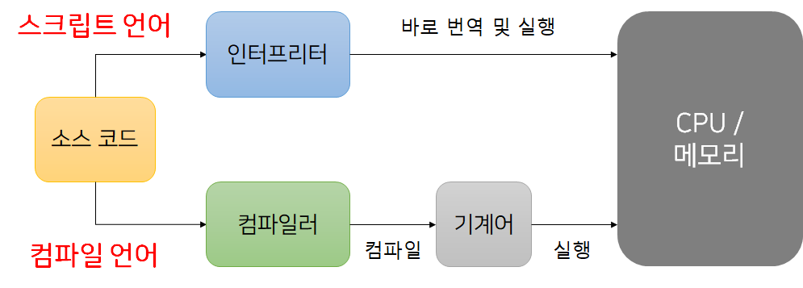

# 인터프리터 언어 컴파일 언어

## 컴파일 언어

소스 코드를 컴파일 한 후 기계어를 Cpu/메모리를 통해 읽어 실행하는 방식으로 동작하는 언어

컴파이을 하기 때문에 컴파일 시간이 필요 하나 컴파일 후 기계어를 통해 프로그램을 실행하기 때문에 실행 시간은 빠르다.

* 언어 : c, java

## 인터프리터 언어

소스코드를 컴파일 하지 않고 코드를 한줄 한줄 읽어 바로 실행하는 방식으로 동작하는 언어

컴파일을 실행하지 않고 바로 실행 한다는 특징이 있지만, 소스 코드를 읽으며 실행하기 때문에 프로그램의 실행 시간은 느리다.

*언어 : python, javascript

### 구조

## 차이

|컴파일러 언어|인터프리터 언어|
|----------|----------|
|코드가 실행되기 전 단계인 컴파일 타임에 소스코드 전체를 한번에 머신 코드로 변환한 후 실행한다.|코드가실행되는 단계인 런타임에 문 단위로 한 줄씩 중간코드인 바이트코드로 변환한 후 실행한다. 
|실행 파일을 생성한다.|실행 파일을 생성하지 않는다.
|컴파일 단계와 실행 단계가 분리되어 있다. 명시적인 컴파일 단계를 거치고 명시적으로 실행 파일을 실행한다.|인터프리트 단계와 실행 단계가 분리되어 있지 않다. 인터프리터는 한 술씩 바이트 코드로 변환하고 즉시 실행한다.
|실행에 앞서 컴파일은 단 한번 수행된다. | 코드가 실행 될 때마다 인터프리트 과정이 반복 수행된다.
|컴파일과 실행 단계가 분리되어 있으므로 코드 실행 속도가 빠르다|인터프리트 단계와 실행 단계가 분리되어 있지 않고 반복 수행되므로 코드 실행 속도가 비교적 느리다.(4~6배 차이)