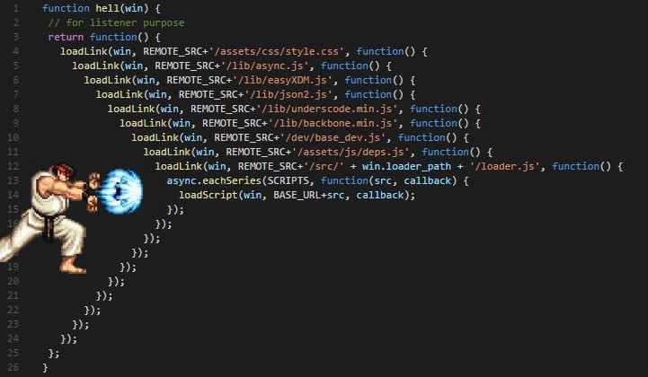

# 프로미스

프로미스는 비동기 작업을 조금 더 편하게 처리할 수 있도록 ES6에 도입된 기능이다. 

비동기 함수를 호출하면 함수 내부의 비동기로 동작하는 코드가 왼료되지 않았다 해도 기다리지 않고 즉시 종료된다. 

즉, 비동기 함수 내부의 비동기로 동작하는 코드는 비동기 함수가 종료된이후에 완료된다. 
따라서 비동기 함수 내부의 비동기로 동작하는 코드에서 처리 결과를 외부로 반환하거나 상위 스코프의 변수에 할당하면 기대한 대로 동작하지 않는다.

비동기 함수의 처리 결과에 대한 후속 처리는 비동기 함수 내부에서 수행해야 한다.
따라서 콜백함수를 전달하는것이 일반적이다. 
> 필요에 따라 비동기 처리가 성공하면 호출될 콜백 함수와 비동기 처리가 실패하면 호출될 콜백 함수를 전달할 수 있다.

이전에는 비동기 작업을 처리 할때 콜백 함수로 처리했지만 콜백 함수로 처리를 하게 된다면, 비동기 작업이 많아질 경우 코드가 싶게 난잡해진다. 

```js
//숫자 n을 파라미터로 받아와 5번에 걸쳐 1초마다 1씩 더해 출력하는 콜백함수
function increaseAndPrint(n, callback) {
  setTimeout(() => {
    const increased = n + 1;
    console.log(increased);
    if (callback) {
      callback(increased);
    }
  }, 1000);
}

increaseAndPrint(0, n => {
  increaseAndPrint(n, n => {
    increaseAndPrint(n, n => {
      increaseAndPrint(n, n => {
        increaseAndPrint(n, n => {
          console.log('끝!');
        });
      });
    });
  });
});
```

이런 식의 코드를 `Callback Hell` 이라 부른다.



비동기적으로 처리해야 할 일이 많아질수록, 코드의 깊이는 길어지게 된다. `Promise`를 사용하면 이런식의 코드의 깊이가 깊어지는 현상을 방지할 수 있다.

비동기 처리를 위핸 콜백패턴의 문제점중 가장 심각한 것은 에러처리가 곤란하다는 것이다. 

```js
try{
    setTimeout(()=>{
        throw new Error('Error');
    }, 1000)
} catch(e){
    console.error('캐치한 애러',e)
}
// 애러를 캐치하지 못한다.
```

`try`코드 블록 내에서 호출한 `setTimeout`함수는 1초후에 콜백함수가 실행되도록 타이머를 설정하고 1초뒤 에러를 발생시키지만 `catch`블록에서 에러를 캐차하지 못한다.

## Promise 생성

```js
const myPromise = new Promise((resolve, reject) => {
    //functions
    if(/*비동기 처리 성공*/){
        resolve('result')
    }else{
        //에러처리를 위해 reject 함수를 호출
        reject('failure reason')
    }
})
```

`Promise`는 성공 할 수도 있고, 실패할 수도 있다. 성공할 때는 비동기 처리 결과를  `resolve` 함수에 인수로 전달하면서 호출하고, 실패할 때는 `reject` 함수수에 인수로 전달하면서 호출한다. 

프로미스는 다음과 같이현재 비동기 처리가 어떻게 진행되고 있는지를 나타내는 상태 정보를 갖는다.

| 프로미스의 상태 정보 | 의미 | 상태 변경 조건 |
|------|------|------|
|`pending`|비동기 처리가 아직 수행되지 않은 상태|프로미스가 생성된직후 기본 상태|
|`fulfilled`| 비동기 처리가 수행된 상태(성공)| `resolve`함수 호출
|`rejected`|비동기 처리가 수행된 상태(실패)| `reject`함수 호출

생성된 직후의 프로미스는 기본적으로 `pending`상태다. 이후 비동기 처리가 수행되면 비동기 처리 결과애 따라 다음과 같이 프로미스의 상태가 변경된다.
* 비동기 처리 성공 : `resolve`함수를 호출해 프로미스를 `fulfilled`상태로 변경한다.
* 비동기 처리 실패 : `reject`함수를 호출해 프로미스를 `rejected`상태로 변경한다.


`fulfilled`, `rejected` 상태를 처리(`settled`) 상태라고 부르고, 처리 상태가 되면 더이상 다른 상태로 변하지 않는다.

#### 프로미스는 비동기 처리 상태와 처리 결과를 관리하는 객체다.

## 프로미스 후속 처리 메서드

프로미스의 처리 상태가 변하면 후속 처리를 해야한다. 이를 위해 프로미스는 후속 메서드 `then`, `catch`, `finally`를 제공한다.

프로미스의 비동기 처리 상태가 변화하면 후속 처리 메서드에 인수로 전달한 콜백함수가 선택적으로 호출된다. 

### Promise.prototype.then

`then` 메서드는 두 개의 콜백 함수를 인수로 전달받는다. 
* 첫 번째 콜백 함수는 프로미스가 `fulfilled`상태가 되면 호출된다. 이때 콜백함수는 프로미스의 비동기 처리결과를 인수로 받는다.
* 두 번째 콜백 함수는 프로미스가 `rejected`상태가 되면 호출된다. 이때 콜백 함수는 프로미스의 에러를 인수로 전달받는다.

> 첫 번째 콜백함수는 비동기 처리가 성공 했을때, 두 번째 콜백함수는 비동기 처리가 실패 했을 때 호출되는 실패 처리 콜백 함수다.

```js
new Promise(resolve => resolve('fulfilled')).then(v=> console.log(v), e=>console.error(e));

new Promise((_,reject)=> reject(new Error('rejected'))).then(v=> console.log(v), e => console.error(e));
```

`then` 메서드는 언제나 프로미스를 반환한다. 만약 `then`메서드의 콜백 함수가 프로미스를 반환하면 그 프로미스를 그대로 반환하고, 콜백 함수가 프로미스가 아닌 값을 반환하면 그 값을 암묵적으로 `resolve`또는 `reject`하여 프로미스를 생성해 반환한다.

## Promise.prototype.catch

`catch`메서드는 한 개의 콜백 함수를 인수로 전달받는다. `catch`메서드의 콜백 함수는 프로미스가 `rejected`상태인 경우만 호출된다.

```js
new Promise((_,reject)=>reject(new Error('rejected'))).catch(e => console.log(e)); // Error: rejected
```

## Promise.prototype.finally

`finally`메서드는 한 개의 콜백 함수를 인수로 전달받는다. 프로미스의 성공 또는 실패와 상관없이 무조건 한번 호출된다. `finally`메서드는 프로미스의 상태와 상관없이 공통적으로 수행해야 할 처리 내용이 있을 때 유용하다. 

```js
new Promise((resovle, reject)=>{
    /*callback function call, return resolve or reject*/
}).finally(()=> console.log('finally')).then(v=> console.log(v), e => console.error(e));
```

## 프로미스 메서드

### Promise.all

`Promise.all`메서드는 여러 개의 비동기 처리를 모두 병렬 차리할 때 사용한다.

```js
const requestData1 = new Promise(relove => setTimeout(() => resolve(1),3000));
const requestData2 = new Promise(relove => setTimeout(() => resolve(2),2000));
const requestData3 = new Promise(relove => setTimeout(() => resolve(3),1000));

//세 개의 비동기 처리를 순차적으로 실행

const res = [];
requestData1()
.then(data => {
    res.push(data);
    return requestData2();
})
.then(data => {
    res.push(data);
    return requestData3();
})
.then(data => {
    res.push(data);
    console.log(res);// [1, 2, 3] => 6초 소요
})
.catch(console.error)
```

비동기 처리가 완료하면 다음 비동기 처리를 수행한다. 위 예제는 첫 비동기 처리에 3초, 두 번째 비동기 처리에 2초, 세 번째 비동기 처리에 1초가 소요되어 6초 이상이 소요된다.

```js
const requestData1 = new Promise(relove => setTimeout(() => resolve(1),3000));
const requestData2 = new Promise(relove => setTimeout(() => resolve(2),2000));
const requestData3 = new Promise(relove => setTimeout(() => resolve(3),1000));

Promise.all([requestData1(),requestData2(),requestData3()])
.then(console.log)//[1, 2, 3] => 3초 소요
.catch(console.error);
```

`Promise.all`메서드는 프로미스를 요소로 갖는 배열등의 이터러블을 인수로 전달받는다. 

전달받은 모든 프로미스가 모두 `fulfilled`상태가 되면 모든 처리결과를 배열에 저장해 새로운 프로미스를 반환한다. 

종료하는데 걸리는 시간은 가장늦게 완료된 상태가 되는 프로미스의 처리 시간보다 조금 더 길다.

이때 첫 번째 프로미스가 가장 나중에 `fulfilled`상태가 되어도 `Promise.all`메서드는 첫 번째 프로미스가 `resolve`한 처리 결과부터 차례대로 배열에 저장해 그 배열을 `resolve`하는 새로운 프로미스를 반환한다. 즉, 처리 순서가 보장된다.

인수로 전달받은 배열의 프로미스가 하나라도 `rejected`상태가 되면 나머지 프로미스를 기다리지 않고 종료된다.

### Promise.race

`Promise.race`메서드는 `Promise.all`메서드와 동일하게 프로미스를 요소로 갖는 이터러블을 인수로 받는다.

`Promise.all`메서드와 달리 가장 먼저 `fulfilled`상태가 된 프로미스의 처리 결과를 `resolve`하는 새로운 프로미스를 반환한다.

```js
Promise.race([
new Promise(relove => setTimeout(() => resolve(1),3000)),
new Promise(relove => setTimeout(() => resolve(2),2000)),
new Promise(relove => setTimeout(() => resolve(3),1000))
])
.then(console.log) //3
.catch(console.error);
```

### Promise.allSettled

`Promise.allSettled`메서드는 전달받은 프로미스가 모두 비동기 처리가 수행된 상태가 되면 처리 결과를 배열로 반환한다.

`Promise.allSettled`메서드가 반환한 배열에는 `fulfilled` 또른 `rejected` 상태와는 상관없이 모든 프로미스들의 처리 결과가 모두 담겨 있다. 

```js
Promise.allSettled([
    new Promise(resolve => setTimeout(()=> resolve(1),2000)),
    new Promise((_,reject) => setTimeout(()=> reject(new Error('Error: ')),1000))
])
.then(console.log);
/*
[
    {status : "fulfilled", value: 1},
    {status : "rejected", reason: Error: Error :at }
]
*/
```

* 프로미스가 `fulfilled`상태일 경우 비동기 처리 상태를 나타내는 `status` 프로퍼티와 처리 결과를 나타내는 `value`프로퍼티를 갖는다.
* 프로미스가 `rejected`상태일 경우 비동기 처리 상태를 나타내는 `status` 프로퍼티와 에러를 나타내는 `reason`프로퍼티를 갖는다.