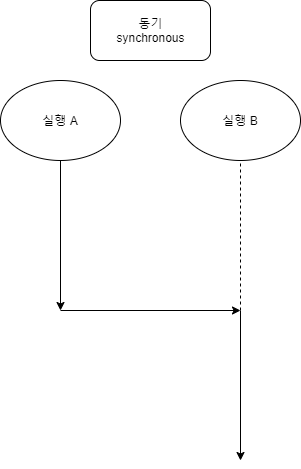
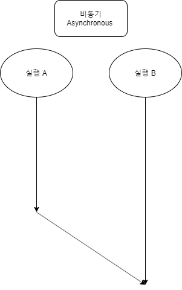

# 동기 비동기

동기(synchronous) : 응답을 받아야만 다음 동작을 실행한다.

* 한번에 하나씩 처리하면서 내려간다
* 순차적으로 처리하기에 비동기에 비해 느리게 결과값이 나타난다.



비동기 (asynchronous) : 응답에 상관입이 바로 다음 프로세스를 진행한다. 

* 여러가지 로직이 동시에 처리된다.
* 매우 빠르게 결과가 도출된다.
* 다른 프로세스의 결과 값을 받아 쓸때 이를 조절해야 한다.



## 타이머함수

함수를 명시적으로 호출하지 않고 일정 시간이 경돠된 이후에 호출되도록 
함수 호출을 예약하려면 타이며 함수를 사용한다.
이를 호출 스케줄링이라 한다.

자바스크립트는 타이머를 생성할 수 있는 타이머 함수 `setTimeout`과 `setInterval`, 타이머를 제거 할수있는
`clearTimeout`과 `clearInterval`을 제공한다.

자바스크립트 엔진은 싱글 스레드로 동작하기 때문에 `setTimeout`과 `setInterval`은 비동기 처리방식으로 동작한다.

### setTimeout/ clearTimeout

`setTimeout`함수는 두 번째 인수로 전달받은 시간 으로 단 한번 동작하는 타이머를 생성한다.
이후 타이머가 만료되면 첫 번재 인수로 전달받은 함수가 호출된다.

`setTimeout(func|code[delay,param1, param2...])`

* func : 타이머가 만료된 뒤 호출될 콜백함수
* delay : 타이머 만료시간(ms 단위), 인수 전달을 안할경우 기본값 0이 지정된다.
* params : 호출된 콜백함수에 전달되어야할 인수가 존재하는 경우 인수로 전달할수 있다.

```js
setTimeout(()=>
    console.log("hello"), 2000
);

//2초뒤 Hello 출력

let timerId = setTimeout((name) => 
console.log(`hello! {name}!`),2000, "eom");

//인자를 3번째부터 넣어 콜백 함수의 인자로 활용할 수 있다.

clearTimeout(timerId);
//타이머id를 전달하여 타이머를 취소한다.
```

`setTimeout`함수는 생성된 타이머를 식별할 수 있는 고유한 타이머 id를 반환한다.

`clearTimeout`함수의 인자로 타이머 id를 전달하면 타이머를 취소할 수 있다.

### setInterval/ clearInterval

`setInterval` 함수는 두 번째 인수로 전달받은 시간으로 반복 동작하는 타이머를 생성한다. 이후 타이머가 만료될 때마다 첫 번재 인수로 전달받은 콜백 함수가 호출된다.

`setInterval(func|code[delay,param1, param2...])`

전달되는 인수는 `setTimeout`함수와 동일하다.

```js
let count = 1;

const timeoutId = setInterval(()=>{
    console.log(count);
    if(count++==5) clearInterval(timeoutId);
}, 1000);

```

---------------------
refereces

https://gocoder.tistory.com/1421